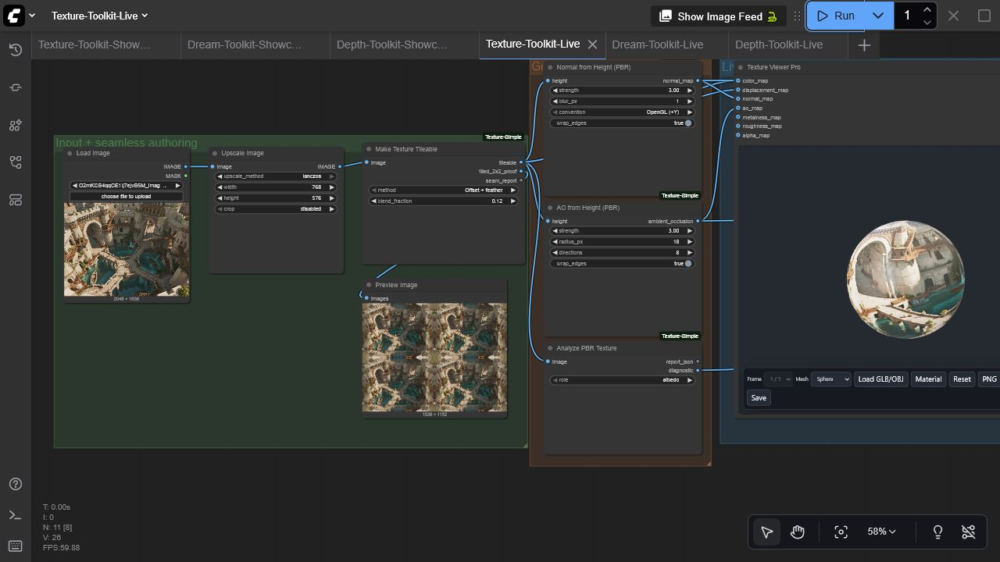

# ComfyUI Texture Simple

A complete offline PBR texture-authoring and live material-validation toolkit for ComfyUI. It turns ordinary images or height maps into production-ready supporting maps, checks them, proves tiling, packs channels, and previews the result on a GPU-accelerated 3D material without leaving the graph.



## Nodes

| Node | Purpose | Outputs |
| --- | --- | --- |
| **Texture Viewer Pro** | Interactive WebGL PBR preview on primitives or a local GLB/OBJ | IMAGE passthrough + live UI |
| **Normal from Height (PBR)** | Wrapped finite-difference normal generation with optional blur and OpenGL/DirectX convention | normal map |
| **AO from Height (PBR)** | Fast multi-direction ambient-occlusion approximation with wrapped edges | AO map |
| **Make Texture Tileable** | Offset-and-feather or mirrored seamless conversion | tileable map, 2×2 proof, seam report |
| **Pack PBR Channels** | RGBA/ORM channel packing with scalar broadcasting | packed texture, manifest |
| **Extract Texture Channel** | Extract red, green, blue, alpha, luminance, max, or average | IMAGE channel + MASK |
| **Analyze PBR Texture** | Role-aware range, clipping, seam, and normal-quality checks | JSON report + diagnostic image |

## Viewer highlights

- Sphere, cube, torus, plane, multi-object showcase, and local GLB/OBJ loading
- Color, displacement, normal, AO, metalness, roughness, and alpha inputs
- Per-map inspection, repeat controls, wireframe, ACES/Neutral/Linear tone mapping, exposure, and IBL
- Batch selection with single-image broadcasting
- PNG capture and GLB, GLTF, or OBJ export
- Lazy/offscreen rendering, bounded device pixel ratio, stale-load cancellation, texture disposal, and WebGL context recovery
- Local pinned Three.js r185 assets; no runtime CDN or telemetry

## Install

Install with ComfyUI Manager, or clone manually:

```bash
cd ComfyUI/custom_nodes
git clone https://github.com/gokayfem/ComfyUI-Texture-Simple.git
python -m pip install -r ComfyUI-Texture-Simple/requirements.txt
```

Restart ComfyUI. The nodes are under `visualization/3D` and `texture/PBR`.

## Start with the live example

Load [`examples/workflows/Texture-Toolkit-Live.json`](examples/workflows/Texture-Toolkit-Live.json), choose an image in **Load Image**, and queue it. The graph creates a seamless texture, normal map, AO map, diagnostics, and a live 3D material. An API-format counterpart is in [`examples/api/texture_toolkit_api.json`](examples/api/texture_toolkit_api.json); replace its image filename with one from your ComfyUI input directory.

For a typical PBR pipeline:

1. Scale/crop the source to the intended working resolution.
2. Make it tileable and inspect the 2×2 proof.
3. Generate normal and AO maps from a suitable height map.
4. Analyze every map using the correct role.
5. Pack ORM channels when targeting glTF engines.
6. Connect the maps to **Texture Viewer Pro** and tune the live material.

## Compatibility and performance

- Python 3.10+; tested in CI on Linux, Windows, and macOS
- Real ComfyUI test: ComfyUI 0.3.60, frontend 1.26.13, Windows, NVIDIA RTX 3090
- NVIDIA, AMD/ROCm, Apple Silicon, Intel, and CPU-only ComfyUI installations are supported: authoring nodes use NumPy/Pillow on the CPU, while the interactive preview uses the browser's WebGL implementation
- Images remain local. Browser-loaded meshes are processed in memory and are never uploaded
- Viewer displacement is intentionally conservative by default so arbitrary inputs remain stable

## Development

```bash
python -m pip install -r requirements.txt pytest build
python -m compileall -q .
pytest -q
python -m build
node --check web/viewer_extension_3_0.js
node --check web/js/threeVisualizer.mjs
```

The vendored Three.js files are MIT licensed; see `web/vendor/THREE-LICENSE.txt`. Security and privacy details are in [`SECURITY.md`](SECURITY.md).

<details>
<summary><strong>Cite this project</strong></summary>

If ComfyUI Texture Simple supports your work, GitHub provides ready-to-copy APA
and BibTeX entries via **Cite this repository**.

```bibtex
@software{Aydogan_ComfyUI_Texture_Simple_2026,
  author  = {Aydoğan, Gökay},
  title   = {ComfyUI Texture Simple},
  version = {3.0.0},
  year    = {2026},
  url     = {https://github.com/gokayfem/ComfyUI-Texture-Simple}
}
```

[ORCID](https://orcid.org/0000-0002-2343-9433) · [Citation metadata](CITATION.cff)

</details>

## Acknowledgements

Thanks to [MrForExample](https://github.com/MrForExample) and the ComfyUI
community for the original viewer patterns and feedback.
